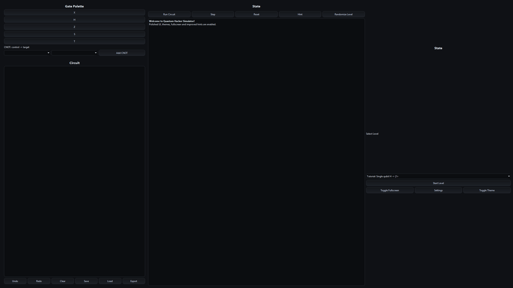

# Quantum Hacker Simulator 🕹️🧠



## Description
Quantum Hacker Simulator is an **educational and fun GUI game** that lets users "hack" quantum systems using **quantum logic gates**. While not a real quantum computer, the simulation provides a basic understanding of quantum computing through **interactive puzzles and hacking-style challenges**.

Developed in **Python 3.10+ with PyQt6**, this project combines **education, gameplay, and advanced GUI features**.

---

## Key Features
- Full GUI with **dark and light themes**
- **Fullscreen mode** with toggle button
- Various levels and challenges:
  - Tutorial: Single qubit H -> |1>  
  - Bell pair: Create entanglement  
  - Superposition race  
  - Custom random 2-qubit  
- **Hint system** with next-step and full-sequence options
- Undo / Redo / Reset functionality
- Random level generator for endless replay
- **Settings dialog**:
  - Resolution selection
  - Hint depth and auto-hint
  - Dark / Light mode toggle
- Save / Load / Export circuits in JSON format
- Polished GUI with tooltips, feedback messages, and progress bars

---

## Installation & Running

### Requirements
- Python 3.10+
- Pip

```bash
pip install numpy PyQt6

Author

Luka - young developer & ethical hacker 💻🕶️

---

License

MIT License